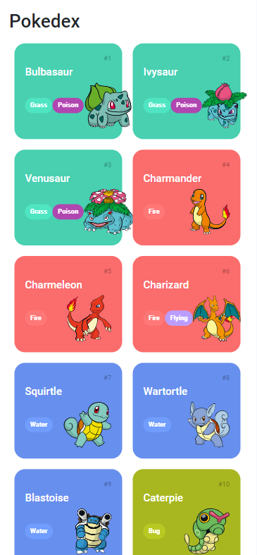

# Pokedex

A Pokedex é um projeto que permite visualizar informações sobre diferentes Pokémon. Este repositório contém o código-fonte e os recursos necessários para criar uma Pokedex simples em HTML, CSS e JavaScript, usando a PokeAPI para buscar dados dos Pokémon.



## Funcionalidades

- Listagem de Pokémon com informações básicas.
- Carregamento progressivo de Pokémon com um botão "Load More".
- Exibição de detalhes de um Pokémon em uma modal ao clicar em um Pokémon da lista.

## Instalação

1. Clone este repositório para o seu ambiente local:

```
git clone https://github.com/seu-usuario/pokedex.git
```

2. Navegue até o diretório do projeto:

```
cd pokedex
```

3. Abra o arquivo `index.html` em seu navegador da web para iniciar a Pokedex.

## Uso

- Ao carregar a Pokedex, você verá uma lista de Pokémon.
- Clique em qualquer Pokémon na lista para ver detalhes adicionais em uma modal.
- Use o botão "Load More" para carregar mais Pokémon à medida que você rola pela lista.

## Dependências

Este projeto utiliza as seguintes bibliotecas e recursos:

- [Normalize CSS](https://necolas.github.io/normalize.css/): Para normalizar o estilo entre diferentes navegadores.
- [Bootstrap](https://getbootstrap.com/): Para estilos e funcionalidades.
- [PokeAPI](https://pokeapi.co/): Para buscar informações sobre os Pokémon.

## Contribuindo

Se você deseja contribuir para este projeto, sinta-se à vontade para abrir um problema (issue) ou enviar um pull request com suas melhorias.

